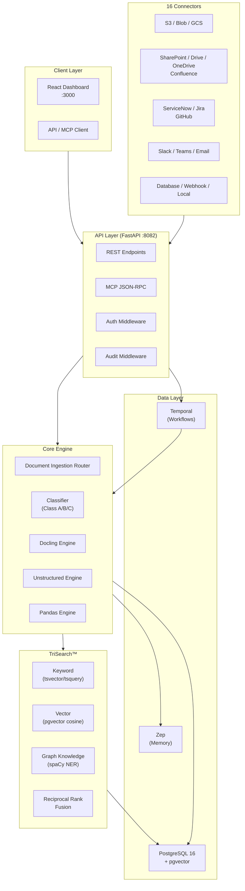

# Architecture Overview

{: .no_toc }

<details open markdown="block">
  <summary>Table of contents</summary>
  {: .text-delta }
1. TOC
{:toc}
</details>

---

## System Design

The Document Ingestion Router follows a modular, event-driven architecture built for scale and compliance.



---

## Component Overview

### API Layer

| Component | Purpose |
|:----------|:--------|
| FastAPI | REST API + OpenAPI docs at `/docs` |
| MCP Endpoints | JSON-RPC for MCP client integration |
| Audit Middleware | FedRAMP AU-2 compliant request logging |
| Auth Middleware | Azure AD / Managed Identity (optional) |

### Core Engine

The Document Ingestion Router is the central component. It:

1. **Classifies** incoming documents using file extension heuristics, filename keyword analysis, and sensitivity detection
2. **Routes** to the appropriate extraction engine
3. **Enriches** chunks with provenance metadata, sensitivity labels, and compliance frameworks
4. **Indexes** content into TriSearch (keyword + vector + graph)

### Data Layer

| Service | Role | Image |
|:--------|:-----|:------|
| PostgreSQL 16 | Primary store + pgvector + tsvector | `pgvector/pgvector:pg16` |
| Zep | Memory management layer | `ghcr.io/getzep/zep` |
| Temporal | Durable workflow orchestration | `temporalio/auto-setup:1.24` |

---

## Technology Stack

| Layer | Technology |
|:------|:-----------|
| Language | Python 3.11 |
| Framework | FastAPI + Uvicorn |
| Database | PostgreSQL 16 + pgvector + pg_trgm |
| Embeddings | Azure OpenAI (`text-embedding-ada-002`) |
| NER | spaCy (`en_core_web_sm`) |
| Workflows | Temporal |
| Memory | Zep |
| Containers | Docker Compose |
| Infrastructure | Azure (Bicep), Azure Gov (GovCloud) |

---

## Directory Structure

```
documentIngestionRouter/
├── docs/                         # This documentation site
├── backend/
│   ├── app/
│   │   ├── main.py               # FastAPI entry point
│   │   ├── config.py             # Pydantic settings
│   │   ├── router/               # Classification engine
│   │   ├── engines/              # Docling, Unstructured, Pandas
│   │   ├── search/               # TriSearch™
│   │   ├── graph/                # Knowledge graph
│   │   ├── connectors/           # 16 data source connectors
│   │   ├── workflows/            # Temporal workflows
│   │   ├── db/                   # SQLAlchemy models
│   │   └── api/                  # Route handlers + middleware
│   ├── db/init.sql               # DB extensions setup
│   ├── Dockerfile
│   ├── Dockerfile.worker
│   └── requirements.txt
├── frontend/                     # React dashboard (TBD)
├── infra/                        # Azure Bicep templates (TBD)
├── docker-compose.yml
├── .env.example
├── LICENSE                       # MIT
└── README.md
```

---

## Security Model

- **Managed Identity** preferred for Azure services
- **Tenant isolation** via `tenant_id` on all data
- **ACL groups** on chunks for row-level security
- **AES-256 at rest** flag for sensitive data
- **TLS 1.3** required in production
- **FIPS 140-2** module support (configurable)
- **Audit logging** on every API request
