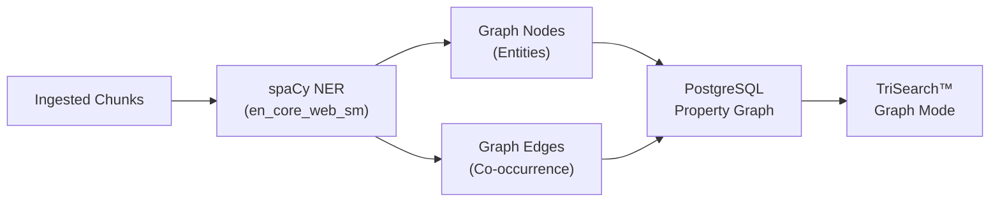

# Graph Knowledge (Gk)

{: .no_toc }

<details open markdown="block">
  <summary>Table of contents</summary>
  {: .text-delta }
1. TOC
{:toc}
</details>

---

## Overview

The Knowledge Graph module extracts named entities from ingested documents using **spaCy NER** and builds a property graph in PostgreSQL. This graph powers the "Graph Knowledge" modality in [TriSearch™](/documentIngestionRouter/trisearch), enabling search by entity relationships.



{: .nist }
> **NIST AI RMF MAP 1.5** — Entity relationships preserve document context and provenance.

---

## How It Works

### 1. Entity Extraction

When a document is ingested, chunks are processed through spaCy's `en_core_web_sm` model:

- Text is limited to 5,000 characters per chunk for performance
- Entities shorter than 3 characters are filtered out
- Entities are deduplicated by normalized (lowercase, trimmed) label

**Extracted entity types** (spaCy defaults):

| Type | Description | Example |
|:-----|:------------|:--------|
| `PERSON` | People | "John Smith" |
| `ORG` | Organizations | "NIST", "Microsoft" |
| `GPE` | Geopolitical entities | "United States" |
| `DATE` | Dates | "January 2024" |
| `LAW` | Legal references | "Executive Order 14028" |
| `PRODUCT` | Products | "Azure OpenAI" |
| `EVENT` | Events | "FedRAMP Assessment" |

### 2. Node Creation

Each unique entity becomes a **graph node** with:

| Field | Description |
|:------|:------------|
| `id` | Unique node ID |
| `label` | Entity text |
| `entity_type` | spaCy entity label (ORG, PERSON, etc.) |
| `document_ids` | Array of source document IDs |
| `tenant_id` | Tenant isolation |
| `properties` | JSONB for extensible metadata |

Nodes are **upserted** — if an entity with the same label and type already exists, the source document is appended to its `document_ids` array.

### 3. Edge Creation

Edges represent **co-occurrence** between entities within the same document:

| Field | Description |
|:------|:------------|
| `source_id` | Source node ID |
| `target_id` | Target node ID |
| `relationship` | Relationship type (`co_occurs`) |
| `weight` | Co-occurrence count (incremented on each new occurrence) |
| `tenant_id` | Tenant isolation |

A sliding window of 5 entities creates edges between nearby entities. Repeated co-occurrences increase edge weight.

### 4. Document Linking

Every node tracks which documents contain the entity via `document_ids`. This enables the graph search to find chunks from related documents even when search terms don't appear in the text.

---

## Querying the Graph

### Entity Search

```bash
curl "http://localhost:8082/api/v1/graph/query?entity=NIST&depth=2"
```

**Query pipeline**:

1. Find nodes matching the query using PostgreSQL `similarity()` (trigram matching, threshold > 0.3)
2. Retrieve edges connected to matching nodes
3. Discover connected nodes (one hop)
4. Return the full subgraph (nodes + edges)

### Graph Statistics

```bash
curl http://localhost:8082/api/v1/graph/stats
```

Returns total nodes, total edges, and entity type distribution.

---

## Storage Model

The graph is stored in PostgreSQL using two tables (no external graph database required):

```sql
-- Nodes (entities)
CREATE TABLE graph_nodes (
    id          TEXT PRIMARY KEY,
    label       TEXT NOT NULL,
    entity_type TEXT NOT NULL,
    document_ids TEXT[],
    tenant_id   TEXT,
    properties  JSONB DEFAULT '{}'
);

-- Edges (relationships)
CREATE TABLE graph_edges (
    id           TEXT PRIMARY KEY,
    source_id    TEXT REFERENCES graph_nodes(id),
    target_id    TEXT REFERENCES graph_nodes(id),
    relationship TEXT NOT NULL,
    weight       FLOAT DEFAULT 1.0,
    tenant_id    TEXT,
    properties   JSONB DEFAULT '{}'
);
```

The `pg_trgm` extension enables trigram similarity matching for fuzzy entity search.

---

## Configuration

| Setting | Description | Default |
|:--------|:------------|:--------|
| spaCy model | NER model | `en_core_web_sm` |
| Text limit | Max chars per chunk | 5,000 |
| Entity min length | Minimum entity text length | 3 characters |
| Co-occurrence window | Entity pairing window | 5 entities |
| Similarity threshold | Minimum trigram similarity | 0.3 |
