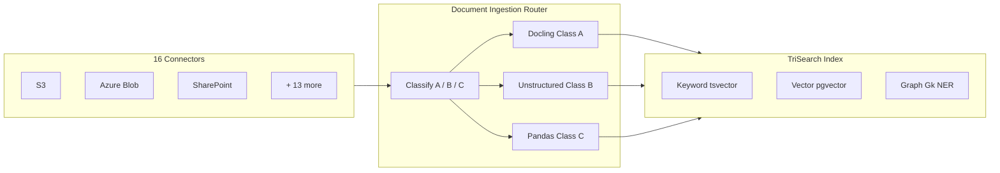

# Document Ingestion Router

Intelligent document classification, extraction, and TriSearch™ indexing for enterprise workloads.

An open-source MCP server created by [Derek Brent Moore](https://github.com/derekbmoore).

---

## What It Does

The Document Ingestion Router is a standalone, open-source **MCP server** that classifies documents by their "truth value," routes them to specialized extraction engines, and indexes them for **TriSearch™** — a unified search across keyword, vector, and knowledge graph modalities.

### Key Capabilities

| Feature | Description |
|:--------|:------------|
| **Truth-Value Classification** | Class A (Immutable), B (Ephemeral), C (Operational) |
| **3 Extraction Engines** | IBM Docling, Unstructured.io, Pandas |
| **TriSearch™** | Keyword + Vector + Graph fused via Reciprocal Rank Fusion |
| **Knowledge Graph** | spaCy NER → PostgreSQL property graph |
| **16 Connectors** | S3, Azure Blob, GCS, SharePoint, and 12 more |
| **Compliance** | NIST AI RMF, FedRAMP High, NIST SP 800-60 |
| **Security** | [Multi-Tenant RBAC](./security.html) |

---

## Architecture



---

## Quick Start

```bash
# Clone
git clone https://github.com/derekbmoore/documentIngestionRouter.git
cd documentIngestionRouter

# Configure
cp .env.example .env

# Run
docker compose up -d

# Upload a document
curl -X POST http://localhost:8082/api/v1/ingest \
  -F "file=@my-document.pdf"

# Search
curl "http://localhost:8082/api/v1/search?q=compliance&mode=trisearch"
```

Open [http://localhost:8082/docs](http://localhost:8082/docs) for the interactive Swagger UI.

---

## License

MIT — see [LICENSE](https://github.com/derekbmoore/documentIngestionRouter/blob/main/LICENSE).

Created by [Derek Brent Moore](https://github.com/derekbmoore). Free for anyone to use.
