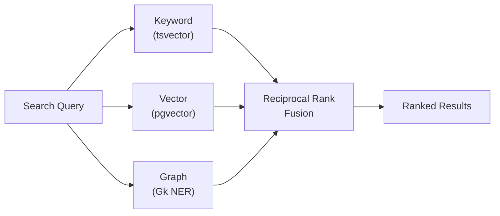

# TriSearch™

{: .no_toc }

<details open markdown="block">
  <summary>Table of contents</summary>
  {: .text-delta }
1. TOC
{:toc}
</details>

---

## Overview

TriSearch™ is a **triple-modality search engine** that fuses keyword, vector, and graph knowledge results into a single ranked list. This provides comprehensive recall: keyword search catches exact terms, vector search finds semantic meaning, and graph search discovers entity relationships.



{: .nist }
> **NIST AI RMF MEASURE 2.1** — Search quality is auditable. Every result includes its `search_mode` and contributing modality counts.

---

## Search Modes

| Mode | Description | Requirements |
|:-----|:------------|:-------------|
| `keyword` | PostgreSQL full-text search only | None |
| `vector` | pgvector cosine similarity only | Azure OpenAI embeddings |
| `graph` | Knowledge graph traversal only | spaCy NER entities |
| `trisearch` | All three fused via RRF | Best with all three enabled |

---

## Keyword Search

Uses PostgreSQL's built-in full-text search with `tsvector` / `tsquery`.

- Chunks are indexed at ingestion time via `to_tsvector('english', text)`
- Queries are parsed with `plainto_tsquery('english', query)`
- Ranking uses `ts_rank()` for relevance scoring
- Supports PostgreSQL's full English stemming and stop word removal

**Strengths**: Exact term matching, boolean operators, fast for known terminology.

---

## Vector Search

Uses `pgvector` cosine similarity with Azure OpenAI embeddings.

| Setting | Value |
|:--------|:------|
| Embedding model | `text-embedding-ada-002` |
| Dimensions | 1536 |
| Distance metric | Cosine similarity (`<=>` operator) |
| Score | `1 - cosine_distance` (higher = more similar) |

**How it works**:

1. Query text is embedded via Azure OpenAI
2. pgvector computes cosine distance against all chunk embeddings
3. Results are sorted by similarity score

**Strengths**: Semantic understanding, finds related content even with different terminology.

{: .important }
> Vector search requires `AZURE_OPENAI_ENDPOINT` and `AZURE_OPENAI_API_KEY` to be configured. Without these, vector search is disabled and TriSearch operates on keyword + graph only.

---

## Graph Knowledge Search

Leverages the knowledge graph built during ingestion (see [Graph Knowledge](/documentIngestionRouter/graph-knowledge)).

**How it works**:

1. Find graph nodes matching the query using PostgreSQL `similarity()` (trigram matching, threshold > 0.3)
2. Traverse edges to discover connected entities
3. Return chunks from documents linked to the matched and connected nodes
4. Default score: 0.7 for graph-discovered results

**Strengths**: Discovers documents connected through entity relationships, even if the query terms don't appear in the text.

---

## Reciprocal Rank Fusion (RRF)

When `mode=trisearch`, results from all three modalities are fused using **Reciprocal Rank Fusion**.

**Formula**: For each result appearing at rank *r* in a result list:

```
RRF_score = 1 / (k + r)
```

Where `k = 60` (constant to prevent top-ranked items from dominating).

Scores from all modalities are summed per chunk ID. The final ranking is sorted by accumulated RRF score, giving balanced weight to all three search methods.

**Example**: A chunk appearing at rank 1 in keyword, rank 3 in vector, and rank 5 in graph:

```
Score = 1/(60+1) + 1/(60+3) + 1/(60+5) = 0.0164 + 0.0159 + 0.0154 = 0.0477
```

---

## Usage

```bash
# Full TriSearch (recommended)
curl "http://localhost:8082/api/v1/search?q=compliance+requirements&mode=trisearch"

# Keyword only
curl "http://localhost:8082/api/v1/search?q=compliance&mode=keyword"

# Vector only
curl "http://localhost:8082/api/v1/search?q=compliance&mode=vector"

# Graph only
curl "http://localhost:8082/api/v1/search?q=NIST&mode=graph"

# With tenant filtering
curl "http://localhost:8082/api/v1/search?q=compliance&mode=trisearch&tenant_id=acme-corp"
```
